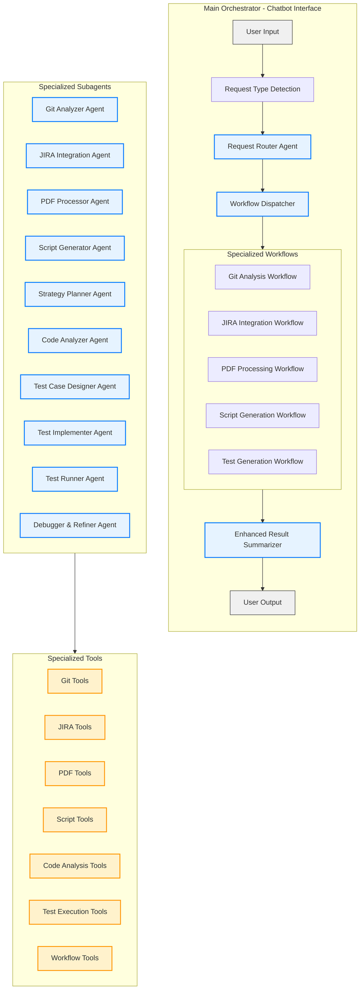

# Enhanced Agent Engine

A sophisticated multi-agent system built on the TestMozart architecture with enhanced capabilities for Git analysis, JIRA integration, PDF processing, and automation script generation.

## Architecture Overview



## Features

### 🤖 **Chatbot Interface**
- Natural language interaction
- Automatic request type detection
- Context-aware routing to specialized workflows

### 🔧 **Specialized Subagents**

#### **Git Analyzer Agent**
- Clone and analyze Git repositories
- Detect code changes and affected files
- Generate change impact analysis
- Prepare data for test generation

#### **JIRA Integration Agent**
- Fetch JIRA tickets and user stories
- Extract requirements and acceptance criteria
- Generate comprehensive test scenarios
- Support for multiple JIRA instances

#### **PDF Processor Agent**
- Extract content from PDF documents
- Analyze document structure and requirements
- Generate test cases from specifications
- Support for requirements documents and API specs

#### **Script Generator Agent**
- Generate automation scripts (CI/CD, deployment, testing)
- Support multiple languages (Python, Bash, PowerShell)
- Include error handling and best practices
- Validate script syntax and security

#### **Strategy Planner Agent**
- High-level test strategy planning
- Risk assessment and prioritization
- Resource and tool recommendations
- Workflow coordination

### 🛠 **Enhanced Capabilities**
- **Multi-format Input**: Git repos, JIRA tickets, PDF documents, code files
- **Intelligent Routing**: Automatic detection and routing of different request types
- **Comprehensive Testing**: Unit, integration, E2E, and API testing
- **Script Automation**: CI/CD, deployment, and maintenance scripts
- **Advanced Analysis**: Code impact analysis, requirement extraction, test coverage

## Installation

1. **Clone the repository**:
   ```bash
   git clone <repository-url>
   cd enhanced_system
   ```

2. **Install dependencies**:
   ```bash
   pip install -r requirements.txt
   ```

3. **Set up environment variables**:
   ```bash
   cp .env.example .env
   # Edit .env with your API keys
   ```

4. **Required API Keys**:
   - `GOOGLE_API_KEY`: For Gemini AI models
   - `JIRA_API_TOKEN`: For JIRA integration (optional)
   - `JIRA_BASE_URL`: Your JIRA instance URL (optional)

## Usage

### **Interactive Chatbot Mode**
```bash
python main_orchestrator.py
```

### **Example Commands**

#### **Git Analysis**
- "Analyze git repository https://github.com/user/repo"
- "Check code changes in the main branch"
- "What files were modified in the last commit?"

#### **JIRA Integration**
- "Generate tests from JIRA ticket PROJ-123"
- "Analyze requirements in https://company.atlassian.net/browse/STORY-456"
- "Create test scenarios from JIRA user story"

#### **PDF Processing**
- "Process PDF document requirements.pdf"
- "Extract test cases from API specification document"
- "Analyze requirements from uploaded PDF"

#### **Script Generation**
- "Generate CI/CD pipeline script for Python project"
- "Create deployment script for Docker application"
- "Generate test automation script"

#### **Test Generation** (Original TestMozart functionality)
- "Generate tests for sample_code.py"
- "Create unit tests for my Python class"
- "Analyze code and generate comprehensive test suite"

## Configuration

### **Environment Variables**
```bash
# Required
GOOGLE_API_KEY=your_gemini_api_key

# Optional - JIRA Integration
JIRA_BASE_URL=https://your-company.atlassian.net
JIRA_USERNAME=your_username
JIRA_API_TOKEN=your_api_token

# Optional - Advanced Features
ENABLE_GIT_ANALYSIS=true
ENABLE_PDF_PROCESSING=true
ENABLE_SCRIPT_GENERATION=true
```

### **Workflow Configuration**
The system automatically detects request types and routes to appropriate workflows:

- **Git Analysis**: Keywords like "git", "repository", "changes", "commit"
- **JIRA Integration**: Keywords like "jira", "ticket", "story", "requirements"
- **PDF Processing**: Keywords like "pdf", "document", "specification"
- **Script Generation**: Keywords like "script", "automation", "ci/cd", "deployment"
- **Test Generation**: Keywords like "test", "unittest", "pytest"

## Architecture Details

### **Core Components**

1. **ChatbotOrchestrator**: Main interface that handles user interactions
2. **RequestRouter**: Analyzes requests and determines appropriate workflow
3. **WorkflowDispatcher**: Routes requests to specialized workflow agents
4. **Specialized Workflows**: Handle specific types of requests
5. **Result Summarizer**: Formats and presents results to users

### **State Management**
- Persistent shared state across all agents
- Context preservation throughout workflows
- Support for complex multi-step processes

### **Tool Integration**
- **Git Tools**: Repository cloning, change analysis, file extraction
- **JIRA Tools**: Ticket fetching, requirement extraction, test scenario generation
- **PDF Tools**: Content extraction, document analysis, test case generation
- **Script Tools**: Automation script generation, syntax validation, deployment scripts

## Extending the System

### **Adding New Subagents**
1. Create agent file in `agents/` directory
2. Implement using `LlmAgent` class
3. Add to workflow in `enhanced_coordinator.py`
4. Create corresponding tools if needed

### **Adding New Tools**
1. Create tool file in `tools/` directory
2. Implement tool functions with proper error handling
3. Add Pydantic models for structured data
4. Register tools with appropriate agents

### **Adding New Workflows**
1. Define workflow in `enhanced_coordinator.py`
2. Add request detection logic
3. Create workflow-specific state variables
4. Update result summarizer for new workflow type

## Comparison with Original TestMozart

| Feature | Original TestMozart | Enhanced Agent Engine |
|---------|-------------------|---------------------|
| **Input Sources** | Local Python files | Git repos, JIRA tickets, PDFs, code files |
| **Interface** | Command-line script | Interactive chatbot |
| **Agent Types** | 5 specialized agents | 10+ specialized agents |
| **Workflows** | Single test generation | 5+ specialized workflows |
| **Request Handling** | Static file input | Dynamic request routing |
| **Output Formats** | Test code only | Tests, scripts, analysis reports |
| **Integration** | None | Git, JIRA, PDF processing |
| **Automation** | Test generation only | Full CI/CD and deployment automation |

## Contributing

1. Fork the repository
2. Create a feature branch
3. Add your enhancements
4. Write tests for new functionality
5. Submit a pull request

## License

This project extends the original TestMozart architecture with additional enterprise-grade capabilities for comprehensive software development automation.

## Support

For questions and support:
- Check the documentation in `/docs`
- Review example configurations in `/examples`
- Submit issues via the issue tracker
